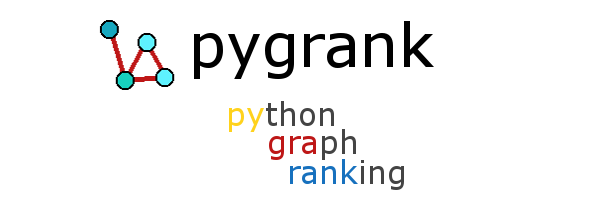

Fast node ranking algorithms on large graphs.
<br>
<sup><sub>Node score diffusion · Recommendation and ranking · Community structure · Link prediction · Graph signal processing</sub></sup>
<br>

**License:** Apache Software License
<br>**Author:** Emmanouil (Manios) Krasanakis
<br>**Dependencies:** `networkx`,`numpy`,`scipy`,`sklearn`,`wget`
<br>**Backends (optional):** `numpy`,`tensorflow`,`pytorch`,`torch_sparse`,`matvec` 
<br><sup><sub>*Externally install non-numpy backends before using them.*</sub></sup>


[](https://pepy.tech/project/pygrank)

# :hammer_and_wrench: Installation
`pygrank` works with Python 3.9 or later. The latest version can be installed with pip per:

# :link: Documentation
**https://pygrank.readthedocs.io**

# :brain: Overview
Analyzing graph edges (links) between graph nodes can help 
rank or score nodes based on proximity to structural or 
attribute-based communities given known example members. 
With the introduction of graph signal processing and 
[decoupled graph neural networks](https://dl.acm.org/doi/abs/10.1145/3442381.3449927),
the importance of node ranking has drastically increased,
as its ability to perform induction by quickly 
spreading node information through edges has 
been theoretically and experimentally corroborated. 
For example, it can be used to make predictions based on 
a few known node attributes or based on the outputs of 
feature-based machine learning models.

`pygrank` is a collection of node ranking algorithms 
and practices that support real-world conditions, 
such as large graphs and heterogeneous preprocessing 
and postprocessing requirements. Thus, it provides 
ready-to-use tools that simplify the deployment of 
theoretical advancements and testing of new algorithms.


Some of the library's advantages are:
1. **Compatibility** with [networkx](https://github.com/networkx/networkx), plain [numpy](https://numpy.org), [tensorflow](https://www.tensorflow.org), [pytorch](https://pytorch.org), [matvec](https://github.com/maniospas/matvec).
2. **Datacentric** interfaces that do not require transformations to identifiers.
3. **Large** graph support with sparse data structures and scalable algorithms.
4. **Seamless** pipelines (e.g., operation [chains](docs/basics/functional.md)), from graph preprocessing up to benchmarking and evaluation.
5. **Modular** components to be combined and a functional chain interface for complex combinations.
6. **Fast** running time with highly optimized operations


# :fire: Features
* Graph filters
* Community detection
* Link prediction
* Graph normalization
* Convergence criteria
* Postprocessing (e.g., fairness awareness)
* Evaluation measures
* Benchmarks
* Autotuning
* Graph Neural Network (GNN) support

# :thumbsup: Contributing
Feel free to contribute in any way, for example through the [issue tracker](https://github.com/MKLab-ITI/pygrank/issues) or by participating in [discussions]().
Please check out the [contribution guidelines](CONTRIBUTING.md) to bring modifications to the code base.
If so, make sure to **follow the pull checklist** described in the guidelines.
 
# :notebook: Citation
If `pygrank` has been useful in your research and you would like to cite it in a scientific publication, please refer to the following paper:
```
@article{krasanakis2022pygrank,
  author       = {Emmanouil Krasanakis, Symeon Papadopoulos, Ioannis Kompatsiaris, Andreas Symeonidis},
  title        = {pygrank: A Python Package for Graph Node Ranking},
  journal      = {SoftwareX},
  year         = 2022,
  month        = oct,
  doi          = {10.1016/j.softx.2022.101227},
  url          = {https://doi.org/10.1016/j.softx.2022.101227}
}
```
To publish research that makes use of provided methods,
please cite all [relevant publications](docs/tips/citations.md).
